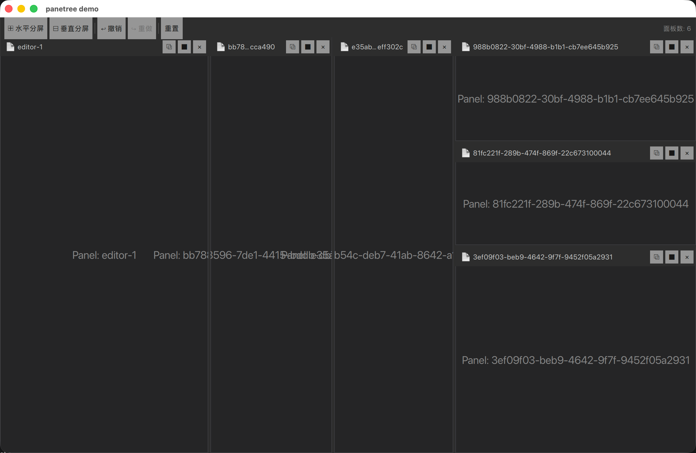

# panetree

递归分割面板的 QML / C++ 库。把任意 QML 内容嵌进可任意嵌套水平/竖直分屏的容器里，
带拖拽改尺寸、撤销/重做、持久化。



## 三个类

- **`QPaneTree::QPaneNode`** —— 树节点。Leaf 持 `viewId`，Split 持 orientation/ratio/first/second。
- **`QPaneTree::QPaneTreeModel`** —— 持根节点 + 所有 mutation API + undo/redo + 序列化。
- **`QPaneTree::QPaneTreeView`** —— QQuickItem 视图，递归渲染整棵树。

QML 类型名（去 namespace）：`QPaneNode` / `QPaneTreeModel` / `QPaneTreeView`。

## 用法

```qml
import PaneTree

QPaneTreeModel { id: paneTree; Component.onCompleted: reset("editor-1") }

QPaneTreeView {
    anchors.fill: parent
    model: paneTree

    leafDelegate: Component {
        MyEditor {
            // 通过 attached property 拿到本 leaf 的标识
            viewId: QPaneTreeView.viewId
            onClose:  paneTree.close(viewId)
            onSplitH: paneTree.split(viewId, Qt.Horizontal)
        }
    }

    // 可选：定制分割条样式
    handleDelegate: Component {
        Rectangle {
            implicitWidth:  QPaneTreeView.orientation === Qt.Horizontal ? 4 : parent.width
            implicitHeight: QPaneTreeView.orientation === Qt.Vertical   ? 4 : parent.height
            color: SplitHandle.hovered ? "#569cd6" : "#2d2d2d"
        }
    }

    // 可选：完全替换 SplitView（含 handle）
    // splitDelegate: Component { SplitView { ... } }
}
```

## 注入给 delegate 的 attached property

| 属性 | 类型 | 作用域 |
|---|---|---|
| `QPaneTreeView.node` | `QPaneNode*` | leaf + split |
| `QPaneTreeView.viewId` | `string` | leaf |
| `QPaneTreeView.nodeId` | `string` | leaf + split |
| `QPaneTreeView.orientation` | `int` | split + handle |
| `QPaneTreeView.ratio` | `qreal` | split |
| `QPaneTreeView.commitRatio()` | invokable | split (传 SplitView 引用) |

## 持久化

```qml
const state = paneTree.saveState()        // 返回 QVariantMap
paneTree.restoreState(state)              // 用 plist/JSON 等持久化
```

## 集成

```cmake
add_subdirectory(third_party/panetree)
target_link_libraries(yourapp PRIVATE panetree panetreeplugin)
```

QML 文件里 `import PaneTree`。
